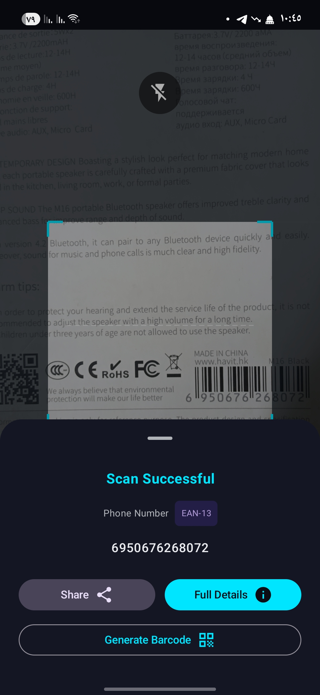
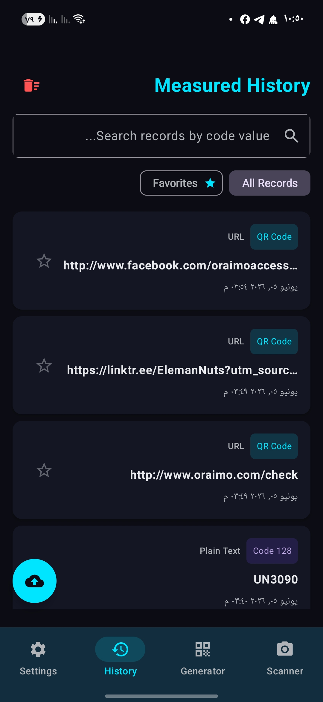
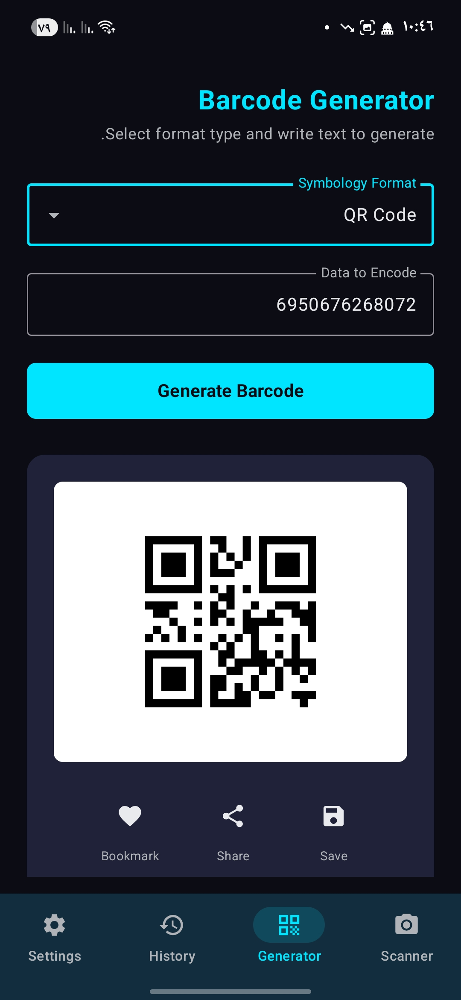
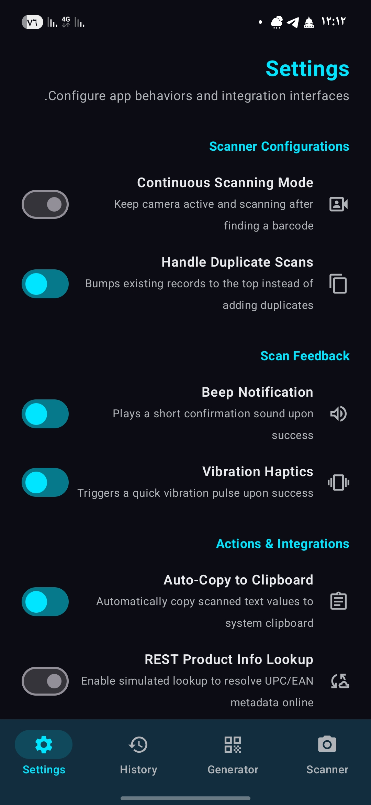

# 📱 ScanPro — The Ultimate Warehouse Scanning & Generation Companion

[](https://android.com)
[](https://kotlinlang.org)
[](#)
[](LICENSE)

**ScanPro** isn't just another barcode reader. It is a tailored, high-speed corporate utility built specifically for logistics heroes, warehouse operations coordinators, and supply chain analysts. It transforms any standard Android device into an industrial-grade scanning and generation powerhouse, making physical auditing, inventory tracking, and data collection smoother and faster than ever before.

---

## 📸 App Preview & Interface

| 📷 Scanner Dashboard | 📊 History & Analytics |
|:---:|:---:|
|  |  |
| **🛠️ Dynamic Barcode Generator** | **⚙️ Advanced Settings Panel** |
|  |  |

---

## ✨ Supercharged Features

* ⚡ **Lightning-Fast Engine:** Powered by Google's advanced ML Kit, capturing barcodes (QR, Data Matrix, Code 128, and more) instantly—even under tough warehouse lighting.
* 🔄 **Continuous Scanning & Duplicate Handling:** Optimize your workflow with non-stop scanning and smart duplicate controls that bump existing records to the top instead of cluttering your logs.
* 🛠️ **On-the-Go Barcode Generator:** Instantly generate multiple symbology formats (like QR Codes) with options to bookmark, share, or save them directly to your device.
* ⚙️ **Granular App Behaviors:** Fully customizable scan feedback (Beep notifications and Vibration haptics) alongside seamless system automation like **Auto-Copy to Clipboard**.
* 🌐 **REST Product Info Lookup:** Advanced integration readiness featuring simulated lookups to resolve UPC/EAN metadata online seamlessly.
* 📊 **One-Click CSV/Excel Export:** Instantly bridge the gap between physical floor-work and digital reporting. Export clean, structured data sheets directly to your device storage.

---

## 🏗️ Cutting-Edge Architecture & Tech Stack

ScanPro is engineered following strict, modern Android development guidelines to ensure rock-solid stability and speed:

* **Architecture:** Clean **MVVM (Model-View-ViewModel)** for distinct separation of concerns and robust data flow.
* **Local Database:** **Jetpack Room**—providing a lightning-fast, secure local SQLite cache for your historical logs.
* **Reactive Async Pipeline:** Driven by **Kotlin Coroutines & Flow** to handle heavy background processing without a single UI stutter.
* **Core Scanning Engine:** Google ML Kit Barcode Scanning API.

---

## 🚀 Installation & Quick Start

Get your development environment running in less than 2 minutes:

1. **Clone the Repository:**
```bash
   git clone [https://github.com/YOUR_USERNAME/ScanPro.git](https://github.com/YOUR_USERNAME/ScanPro.git)